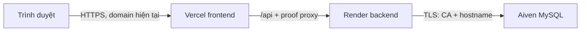

# Chuẩn bị chuyển PrismaXI: Render Free + Aiven MySQL Free

Ngày kiểm tra: **08/10/2026, giờ Việt Nam**. Lượt này chỉ chuẩn bị file, đọc cấu hình/metadata nguồn và kiểm tra local. **Chưa tạo dịch vụ, đổi proxy/kết nối production, xuất dump mới, nhập Aiven, dừng Railway, commit hoặc push.** Giữ nguyên các thay đổi tài liệu Minigame đang có.

## Kiến trúc và file chuẩn bị



Frontend/domain vẫn ở Vercel. Trình duyệt tiếp tục gọi URL tương đối `/api`, dùng cookie cùng origin. Backend Render không thay public origin của auth/Google.

| File | Vai trò |
| --- | --- |
| `backend/Dockerfile` | Build Maven/Java 21, chạy JRE 21 bằng user không phải root |
| `backend/.dockerignore` | Chỉ cho phép mã/resources cần build; loại target, DB/dump, env, chứng chỉ và test |
| `backend/docker-entrypoint.sh` | Nạp CA Aiven thành truststore MySQL riêng, từ chối URL có query override TLS hoặc sai profile |
| `backend/.gitattributes`, `.gitignore` | Giữ entrypoint LF; ignore env local, thư mục secrets và truststores/CA Aiven |
| `backend/src/main/resources/application-render.properties` | Profile bổ sung sau `prod`: bind `0.0.0.0`, TLS xác minh hostname/CA, UTC, pool nhỏ, không tự tạo schema |
| `render.yaml` | Blueprint Free, Docker context `backend`, health `/actuator/health`, auto deploy `off`; chưa sync |
| `docs/deployment/vercel.render.example.json` | Mẫu đổi upstream; không phải cấu hình Vercel đang chạy |
| `backend/sql/2026-10-08-render-aiven-preflight.sql` | Chỉ đọc version/schema/collation/index/constraint nguồn và đích |
| Hai test `Render*Test` và test mẫu proxy | Kiểm tra config/TLS/proxy liên quan |

Repo trước lượt này chưa có Dockerfile. `application.properties` đã có `server.port=${PORT:8080}`; không cần đổi POM lên Java 26. POM vẫn release 21, máy local dùng JDK 26. Docker build dùng JDK 21 và runtime dùng JRE 21. Hai CSV mà POM đóng gói vẫn là resources đã có; **không dùng chúng để thay việc sao chép database**.

## Thiết lập Render sau khi được giao lượt chuyển thật

Web Service, Docker, plan **Free**, `dockerfilePath=./backend/Dockerfile`, `dockerContext=./backend`, branch/commit đã review, auto deploy **off**, Docker Command để trống. Với Dashboard, dùng Root Directory `backend`, Dockerfile `./Dockerfile`, context `.`; không trộn đường dẫn Dashboard tương đối Root Directory với đường dẫn Blueprint tương đối repo. Health check `/actuator/health`. Không tạo Pre-deploy Command, cron, bootstrap hoặc disk/H2.

Render cung cấp `PORT` mặc định 10000; Spring đọc giá trị đó, bind `0.0.0.0`. `EXPOSE 10000` chỉ là metadata Docker, không thay `PORT`. [`PORT` và port binding](https://render.com/docs/web-services), [Docker/Blueprint paths](https://render.com/docs/blueprint-spec).

Free hiện có **0,1 CPU / 512 MB RAM**. JVM dùng heap tối đa 50% giới hạn container để chừa bộ nhớ cho metaspace/thread/native; Tomcat tối đa 30 thread, Hikari tối đa 4 connection, minimum-idle 0, không bật keepalive. Đây là cấu hình ban đầu, chưa phải xác nhận Spring Boot chạy ổn trong 512 MB thực tế. Cần đo startup/RSS và health trên container Free trước cutover. [Compute plans](https://render.com/docs/compute-plans).

Blueprint chọn Render Singapore; chọn Aiven gần vùng này **nếu** Free cho phép. Nếu vùng Free cố định xa, đo RTT thay vì giả định kết nối nội bộ; Aiven là kết nối công khai có TLS. Aiven Free hiện có 1 GB RAM, 1 GB disk, tối đa 76 connection, một node, không SLA. Cần theo dõi dung lượng Minigame snapshots/actions và sessions; dung lượng nguồn hiện nhỏ không đảm bảo đủ mãi. [Aiven Free](https://aiven.io/docs/products/mysql/concepts/mysql-free-tier).

## TLS Aiven: xác minh CA và hostname

1. Lấy hostname/port/user/password từ service Aiven thực sự; không dùng IP thay hostname hoặc hostname proxy Railway. Database đề xuất giữ tên **`railway`** để không phải sửa schema/dump; xác nhận Aiven user được tạo database này. Nếu phải đổi tên, dùng dump không có `CREATE DATABASE`/`USE` và restore vào schema đích đã kiểm tra, không replace text toàn file SQL.
2. Tải **CA Certificate** từ đúng service/project Aiven. Tạo Render Secret File `aiven-ca.pem`, nội dung PEM/bundle, runtime ở `/etc/secrets/aiven-ca.pem`. Không commit CA/truststore/credentials vào image. File này phải có trước khi app chạy; sync Blueprint có thể tạo deployment đầu tiên dù auto-deploy off. [Secret files](https://render.com/docs/configure-environment-variables).
3. Đặt `PREMIERHUB_JDBC_URL=jdbc:mysql://AIVEN_HOST:AIVEN_PORT/railway` **không query, fragment hoặc credentials trong URL**. Credentials dùng hai biến riêng. Entry point yêu cầu đúng `SPRING_PROFILES_ACTIVE=prod,render` và từ chối URL có `?` để tránh tham số URL ghi đè TLS profile.
4. Entry point dùng `keytool` nhập từng CA trong bundle vào PKCS12 dưới `/tmp`, xuất `PREMIERHUB_DB_TRUSTSTORE_URL` cho profile. Tạo lại mỗi lần start nên không phụ thuộc filesystem tồn tại sau sleep. Mật khẩu `changeit` chỉ bảo vệ container truststore chứa **CA công khai**, không phải database password hay private key.
5. Connector/J dùng `sslMode=VERIFY_IDENTITY`, `fallbackToSystemTrustStore=false`, truststore PKCS12 riêng cho datasource. UTC dùng `connectionTimeZone=UTC` và `forceConnectionTimeZoneToSession=true`; không gắn thêm tham số URL. Không đổi global `javax.net.ssl.trustStore` sang CA Aiven vì Google HTTPS vẫn cần truststore hệ thống.
6. CLI Aiven dùng `--ssl-mode=VERIFY_IDENTITY --ssl-ca=<CA-file>` và đúng hostname. Xác nhận `Ssl_cipher` không rỗng; kết nối thất bại nếu CA sai hoặc hostname không khớp. **Không** chữa lỗi bằng `useSSL=false`, `verifyServerCertificate=false`, `sslMode=REQUIRED/PREFERRED`, `trustAll` hoặc bỏ CA. Kiểm tra CA đúng project, chuỗi chứng chỉ, DNS/SAN, thời hạn và đồng hồ.

Aiven MySQL cần project CA khi dùng VERIFY_CA/VERIFY_IDENTITY; bundle có thể gồm CA cũ/mới khi rotation. Phải cập nhật file CA trước lần rotation cuối. [Aiven TLS/rotation](https://aiven.io/docs/platform/concepts/tls-ssl-certificates), [Connector/J TLS/truststore](https://dev.mysql.com/doc/connector-j/en/connector-j-connp-props-security.html). Không sao chép ví dụ chỉ bật mã hóa của hướng dẫn Java rồi coi là đã xác minh hostname.

## Biến cần chuyển chính xác

Đã đọc danh sách biến backend Railway trong bộ nhớ, không in/lưu giá trị secret. **20 biến ứng dụng hiện được đặt** (không gồm biến Railway quản lý):

| Biến hiện có | Cách đặt trên Render |
| --- | --- |
| `SPRING_PROFILES_ACTIVE` | Đổi `prod` thành **`prod,render`**, đúng thứ tự |
| `JAVA_TOOL_OPTIONS` | Dùng memory options của Blueprint và `-Duser.timezone=UTC`; review options cũ nếu cần, không mang heap lớn của máy khác sang Free |
| `PREMIERHUB_JDBC_URL` | Đổi sang Aiven host/port/schema, không query; không copy `mysql.railway.internal` hoặc URL MySQL/PG sai định dạng |
| `PREMIERHUB_DB_USER` | User Aiven; không copy Railway user theo tên một cách mặc định |
| `PREMIERHUB_DB_PASSWORD` | Password Aiven, nhập riêng qua Dashboard/secret manager |
| `PREMIERHUB_AUTH_PROXY_SECRET` | Giữ nguyên secret đang khớp với **Vercel**; không generate lại một phía |
| `PREMIERHUB_AUTH_PUBLIC_ORIGIN` | Giữ `https://premierhub.vercel.app` |
| `PREMIERHUB_AUTH_TRUSTED_PROXIES` | Giữ rỗng như hiện tại; không thêm CIDR Render tùy tiện |
| `PREMIERHUB_CORS_ALLOWED_ORIGINS` | Giữ frontend origin hiện tại |
| `PREMIERHUB_GOOGLE_CLIENT_ID` | Chuyển riêng giá trị hiện có, không in vào tài liệu/Git |
| `PREMIERHUB_GOOGLE_CLIENT_SECRET` | Chuyển riêng secret hiện có |
| `PREMIERHUB_GOOGLE_FRONTEND_ORIGIN` | Giữ frontend origin hiện tại |
| `PREMIERHUB_GOOGLE_CALLBACK_URI` | Giữ `https://premierhub.vercel.app/api/auth/google/callback` |
| `PREMIERHUB_MINIGAME_ENABLED` | Giữ `true` khi database đích đã có đủ schema/data |
| `PREMIERHUB_MINIGAME_LOCAL_DATA_ENABLED` | Giữ `false` |
| `SERVER_FORWARD_HEADERS_STRATEGY` | Giữ `none`; proof Vercel và public-origin wrapper vẫn xử lý auth |
| `SERVER_SERVLET_SESSION_COOKIE_SECURE` | Giữ `true` |
| `SERVER_SERVLET_SESSION_COOKIE_HTTP_ONLY` | Giữ `true` |
| `SERVER_SERVLET_SESSION_COOKIE_SAME_SITE` | Giữ `lax` |
| `SERVER_SERVLET_SESSION_COOKIE_PATH` | Giữ `/` |

`SERVER_SERVLET_SESSION_COOKIE_DOMAIN` hiện không đặt: tiếp tục **không đặt** để cookie host-only ở frontend. Không đổi callback Google sang `.onrender.com`; không đổi domain/DNS Vercel hoặc tạo OAuth client mới chỉ để đổi backend. Nếu frontend đã thêm custom domain sau checkpoint này, đọc lại chính xác public origin/callback đã đăng ký trước cutover; không giả định alias dùng cùng cookie.

Biến/file bổ sung:

- `PORT`: Render tự cấp, không copy port Railway; profile chung đã đọc nó.
- Secret File `aiven-ca.pem`: bắt buộc. `PREMIERHUB_AIVEN_CA_FILE` chỉ cần đặt nếu đổi đường dẫn mặc định.
- `PREMIERHUB_DB_TRUSTSTORE_URL`: entrypoint tạo, không phải secret cần chuyển hay biến phải nhập Dashboard.
- `SPRING_SQL_INIT_MODE=never`, `SPRING_SESSION_JDBC_INITIALIZE_SCHEMA=never`: hiện được đảm bảo bởi file prod/render; nếu đặt env thì giữ never. Session timeout hiện 30m từ cấu hình chung; nếu sau này đổi `SPRING_SESSION_TIMEOUT`, chuyển đúng giá trị đã review.

Các biến code có hỗ trợ nhưng **không đặt ở Railway hiện tại**, chỉ mang sang nếu đã bổ sung thực sự trước cutover:

| Nhóm | Tên biến |
| --- | --- |
| Rate limit login IP | `PREMIERHUB_AUTH_LOGIN_IP_ATTEMPTS`, `PREMIERHUB_AUTH_LOGIN_IP_WINDOW` |
| Rate limit login email | `PREMIERHUB_AUTH_LOGIN_EMAIL_ATTEMPTS`, `PREMIERHUB_AUTH_LOGIN_EMAIL_WINDOW` |
| Rate limit registration | `PREMIERHUB_AUTH_REGISTER_IP_ATTEMPTS`, `PREMIERHUB_AUTH_REGISTER_IP_WINDOW` |
| Rate limit Google | `PREMIERHUB_AUTH_GOOGLE_IP_ATTEMPTS`, `PREMIERHUB_AUTH_GOOGLE_IP_WINDOW` |
| Bộ nhớ/cleanup rate limiter | `PREMIERHUB_AUTH_LIMIT_MAX_ENTRIES`, `PREMIERHUB_AUTH_LIMIT_CLEANUP_INTERVAL` |
| CLI thu thập dữ liệu, không cần cho API web chỉ đọc | `API_FOOTBALL_KEY`, `FOOTBALL_DATA_API_KEY` |

Không bật các property console/import trong web service: `premierhub.sync.enabled`, `football-data.enabled`, `club-information.enabled`, `player-positions.enabled`, `player-profiles.enabled`, `manual-match-stats.enabled`, `manual-season-stats.enabled`, `fixture-evidence.enabled`, `fantasy-evidence.enabled`, `manual-roster.enabled`, `match-lineups.enabled` (mọi tên ở đây có tiền tố `premierhub.`). Không đặt `premierhub.snapshot.mode` hoặc copy tham số chạy command snapshot vào web service. Không ghép profile `minigame-local`/`auth-local` hoặc chuyển `.env.local` vào image.

Không chuyển 11 biến Railway quản lý: `RAILWAY_ENVIRONMENT`, `RAILWAY_ENVIRONMENT_ID`, `RAILWAY_ENVIRONMENT_NAME`, `RAILWAY_PRIVATE_DOMAIN`, `RAILWAY_PROJECT_ID`, `RAILWAY_PROJECT_NAME`, `RAILWAY_PUBLIC_DOMAIN`, `RAILWAY_SERVICE_EPL__PERSONAL_URL`, `RAILWAY_SERVICE_ID`, `RAILWAY_SERVICE_NAME`, `RAILWAY_STATIC_URL`. Biến connection của MySQL service như `MYSQLHOST`, `MYSQLPORT`, `MYSQLUSER`, `MYSQLPASSWORD`, `MYSQLDATABASE`, `MYSQL_URL`, `MYSQL_PUBLIC_URL`, `RAILWAY_TCP_PROXY_*` cũng không phải cấu hình datasource cần copy nguyên sang Render. Đọc lại tên biến vào ngày chuyển để phát hiện biến mới; không export nguyên JSON env hoặc screenshot secrets.

## Proxy Vercel và cold start

File đang có hiệu lực là **`frontend/vercel.json`**, project Vercel Root Directory **`frontend`**. Đổi đúng **`routes[0].dest`** ở lượt cutover:

```text
https://epl-personal-production.up.railway.app/api/$1
→ https://BACKEND-THUC-TE.onrender.com/api/$1
```

Mẫu đầy đủ ở [vercel.render.example.json](deployment/vercel.render.example.json). Thay hostname placeholder bằng Render URL thực sự; không dùng file mẫu để deploy trước khi service/DB sẵn sàng. Giữ `/api/(.*)`, `$1`, query forwarding, request transform **set** `x-prismaxi-proxy-secret` từ `PREMIERHUB_AUTH_PROXY_SECRET`, `no-store`/tắt rewrite caching, thứ tự route trước filesystem và SPA fallback. Không trả secret trong response header, không khôi phục `VITE_API_BASE_URL` và không chuyển fetch trực tiếp sang Render. Vercel vẫn cần secret cùng giá trị với Render trong environment production.

Ở lượt cutover, cập nhật cả kỳ vọng upstream trong `frontend/src/api/deployment.test.js` (hiện xác nhận Railway), giữ các kiểm tra path/secret/no-store và chạy riêng test này. File mẫu vẫn giữ placeholder để tránh bị hiểu là đích đã được xác nhận.

Giới hạn hiện hành của proxy external `routes`/`rewrites` là **120 giây cho cả Hobby, Pro và Enterprise**; quá hạn có thể trả `ROUTER_EXTERNAL_TARGET_ERROR`. `maxDuration` của Vercel Function không tăng thời gian cho proxy này. Repo dùng route ngoài, không có Function riêng. [Vercel limits](https://vercel.com/docs/limits).

Render Free ngủ sau 15 phút không có inbound traffic, thức khi có request; tài liệu nói khoảng một phút và có thể trả trang loading trong lúc thức. Filesystem runtime không bền qua restart/sleep; Free không có shell/one-off job và maintenance mode của nền tảng yêu cầu paid. Có 750 instance-hour/workspace/tháng, giới hạn build/bandwidth và có thể bị suspend nếu lưu lượng chủ động ra ngoài cao, kể cả truy cập DB ngoài. [Free service limits](https://render.com/docs/free), [maintenance field](https://render.com/docs/blueprint-spec).

**Suy luận cho PrismaXI:** cold start cộng JVM/Spring/TLS/DB startup có thể vượt 120 giây hoặc trả HTML trước JSON. Không thể cam kết request đầu luôn thành công. Frontend hiện không đặt deadline ngắn riêng cho fetch auth/Minigame/Fantasy; AbortController chủ yếu hủy khi rời trang. API clients có xử lý phản hồi không phải JSON/network error; Minigame giữ thao tác chưa chắc chắn và cho đọc tiến trình/gửi lại cùng action ID. Chưa sửa UX hoặc tạo cron/keep-warm ở lượt này.

Trước khi người dùng login/ghi lần đầu sau sleep, thử một GET info công khai qua `/api`, đợi JSON hợp lệ rồi thử lại nếu cần. Nếu POST timeout: không tự gửi POST với ID mới; đọc lại tiến trình/đội và kiểm tra phiên, retry theo cơ chế hiện có. Trước Fantasy submit, đọc lại version/status và deadline. Phiên lưu JDBC vẫn ở Aiven khi Render ngủ, nhưng session có thể hết hạn bình thường sau 30m. Daily vẫn tính ngày Asia/Ho_Chi_Minh khi backend thức; không cần cron hoặc đổi đồng hồ production.

Chưa có Render URL/service để đo cold-start thực tế. Khi chạy thật phải ghi thời gian GET lạnh/ấm qua Vercel, HTTP status/content-type, RSS/health và kiểm tra header `X-Vercel-Forwarded-For` được Render giữ; public health 200 một mình không chứng minh private auth/proxy hoạt động.

## Toàn bộ database cần sao chép

Inventory chỉ đọc nguồn ngày 08/10: MySQL **9.7.2**, database `railway`, UUID `8835db23-b8ca-11f1-89a0-a2aa18198d9d`, **42 bảng InnoDB**, DATA_LENGTH+INDEX_LENGTH khoảng **2.578 MiB** (2.703.360 byte, không phải kích thước dump cuối). Collation hiện có `utf8mb4_0900_ai_ci`, `utf8mb4_0900_bin`; 0 view/routine/trigger/event. Bản backup Minigame trước đó chỉ có 35 bảng, **không dùng làm dump cutover**.

Danh sách để đối chiếu, không dùng làm filter dump:

- Tài khoản/phiên (4): `accounts`, `account_identities`, **`SPRING_SESSION`**, **`SPRING_SESSION_ATTRIBUTES`**.
- Fantasy (9): `fantasy_gameweeks`, `fantasy_deadline_changes`, `fantasy_entries`, `fantasy_draft_picks`, `fantasy_submitted_picks`, `fantasy_fixture_confirmations`, `fantasy_unrated_confirmations`, `fantasy_result_publications`, `fantasy_team_results`.
- Minigame (7): `player_guess_selector`, `player_guess_questions`, `player_guess_games`, `player_guess_practice_state`, `player_guess_guesses`, `player_guess_actions`, `player_guess_daily_results`.
- Bóng đá/nguồn/sync (22): `clubs`, `players`, `seasons`, `season_clubs`, `standings`, `fixtures`, `fixture_player_stats`, `fixture_lineups`, `fixture_lineup_players`, `fixture_score_evidence`, `manual_fixture_player_stats`, `manual_player_memberships`, `player_season_stats`, `player_season_profiles`, `player_specific_positions`, `player_eligible_positions`, `player_profile_estimates`, `club_season_formations`, `club_season_information`, `football_data_fixtures`, `football_data_teams`, `sync_states`.

Chuyển **toàn schema ứng dụng**, gồm mọi mùa 2024/25 và 2026/27, giữ dữ liệu nguyên vẹn; không nhập lại CSV, tái tính thống kê, seed account/đáp án, reset Minigame hoặc mở lại Fantasy để thay việc copy. Không dump/import database hệ thống `mysql`, users/grants/roles của server Railway vào managed Aiven; app accounts nằm ở bảng `accounts` và vẫn phải chuyển đủ. DB user Aiven cấp riêng quyền runtime phù hợp, không sao chép password root hệ thống.

Phiên được serialize trong BLOB phải giữ byte nguyên vẹn; account ID, hash mật khẩu, provider subject/liên kết Google, roles không đổi. Giữ case tên `SPRING_SESSION*` trên MySQL Linux. Fantasy giữ đội draft/submitted, revisions, deadline/audit và kết quả. Minigame giữ snapshot (có đáp án ẩn), chu kỳ selector, game/version/actions chống retry trùng, guesses, daily ledger/lịch sử. Không in các dữ liệu này vào log/tài liệu/Git hoặc dùng session dump để mạo danh người chơi.

### Diễn tập trước khi đặt lịch bảo trì

1. Khi được phép chuyển thật, tạo Aiven Free/Render, lấy đúng CA và xác nhận quyền/region/version. Aiven hỗ trợ hai major version từ 8.4; chưa biết phiên bản của service sẽ tạo. Nếu thấp hơn nguồn 9.7.2, phải kiểm tra logical restore trên đúng version, không copy datadir và không coi downgrade đã tương thích. [Aiven version management](https://aiven.io/docs/products/mysql/howto/manage-mysql-version).
2. Chạy preflight nguồn/đích; đích phải đúng hostname/service, schema ứng dụng mới/rỗng, collation/CHECK/FK/index tương thích. Giữ app/backend đích dừng trong lúc import. Không chạy migration H2 hoặc tạo schema Spring Session tự động trước restore.
3. Lấy backup rehearsal đầy đủ ra ngoài Git theo quyền xuất đã được xác nhận ở lượt đó, ghi SHA-256/coverage/footer/exit code, thử restore vào đích rehearsal cô lập. Nguồn vẫn có thể được dùng trong rehearsal nên rehearsal không phải dump cuối; nếu so hash thì lấy cùng snapshot hoặc quiesce nguồn, không kết luận mất dữ liệu chỉ vì source đang nhận ghi mới.
4. Diễn tập build image, TLS đúng/sai, Render health và public/protected API. Nếu thử user flow ở clone, dùng dữ liệu/phiên được chủ tài khoản cho phép hoặc phiên mới của họ; không trích session từ dump để impersonate. Không đưa account giả/điểm test từ clone vào dump nguồn/final.
5. Đo thời gian dump/import/đối chiếu, so schema và COUNT(*)/hash rows, dùng đó chốt thời lượng bảo trì. Không bắt đầu cutover nếu restore/schema/TLS thất bại, Free không đủ tài nguyên hoặc chưa đo cold start.

### Dump cuối và import: lệnh mẫu cho lượt được phép

Chuẩn bị credentials riêng trong môi trường terminal/secret manager, không đặt password trên argv, không in env. File dump mới phải ngoài repo, không ghi đè backup cũ. Ví dụ thư mục `D:\File Jva\PrismaXI-backups\render-aiven-cutover-<timestamp>`. Lệnh dưới chỉ là hướng dẫn, **chưa chạy** ở lượt chuẩn bị.

```powershell
$transferDumpClient = 'C:\Program Files\MySQL\MySQL Server 9.6\bin\mysqldump.exe'
$transferRepoRoot = [IO.Path]::GetFullPath((Get-Location).Path)
$transferDumpFile = [IO.Path]::GetFullPath($env:TRANSFER_DUMP_FILE)
if ($transferDumpFile.StartsWith($transferRepoRoot + [IO.Path]::DirectorySeparatorChar, [StringComparison]::OrdinalIgnoreCase)) { throw 'Choose a path outside the repo.' }
if (Test-Path -LiteralPath $transferDumpFile) { throw 'Do not overwrite an existing backup.' }
# MYSQL_PWD here contains the source credential; do not print it.
# REQUIRED matches the current Railway source connection, not the new Aiven TLS policy.
# If source verification/CA is strengthened before cutover, retain that mode/CA instead.
$transferSourceArgs = @('--no-defaults','--protocol=TCP',"--host=$env:TRANSFER_SOURCE_HOST", "--port=$env:TRANSFER_SOURCE_PORT", "--user=$env:TRANSFER_SOURCE_USER",'--ssl-mode=REQUIRED')
& $transferDumpClient @transferSourceArgs --single-transaction --quick --routines --triggers --events --hex-blob --tz-utc --no-tablespaces --set-gtid-purged=OFF --column-statistics=0 --skip-add-drop-table --default-character-set=utf8mb4 "--result-file=$transferDumpFile" railway
if ($LASTEXITCODE -ne 0) { throw 'Dump failed; stop cutover.' }
Get-FileHash -LiteralPath $transferDumpFile -Algorithm SHA256
```

Dump toàn schema bằng positional database name, không truyền danh sách table và không dùng `--databases`/`--all-databases`: giữ toàn bộ bảng ứng dụng nhưng không mang `CREATE DATABASE`/`USE` và database hệ thống vào đích. `--hex-blob` giữ phiên/auth BLOB; no GTID/tablespaces giảm yêu cầu đặc quyền server; `--skip-add-drop-table` bảo vệ đích nếu operator chọn nhầm database đã có dữ liệu. `single-transaction` không bao gồm ghi sau snapshot và không bảo vệ trước concurrent DDL: phải quiesce nguồn trước dump cuối. [mysqldump options](https://dev.mysql.com/doc/refman/8.4/en/mysqldump.html).

Nguồn Railway hiện dùng TLS REQUIRED (mã hóa, chưa xác minh CA/hostname), đã đối chiếu service/database/UUID. Điều này không phải cấu hình Aiven mới: đích CLI/JDBC bắt buộc VERIFY_IDENTITY. Không hạ mức kiểm chứng đang có để sửa lỗi. Nếu yêu cầu cả nguồn có xác minh CA trước export, cần lấy CA nguồn đáng tin cậy và thử VERIFY_IDENTITY; không tự tin cậy chứng chỉ tải từ endpoint chưa xác minh.

Kiểm tra dump đủ CREATE TABLE cho inventory mới nhất (hiện 42), footer hoàn tất, exit 0, SHA-256; giữ bản gốc và log import riêng ngoài Git. Hiện không có definer object. Nếu ngày chuyển xuất hiện view/routine/trigger/event, review quyền/DEFINER và compatibility riêng; không xóa trigger/routine hoặc replace text toàn dump để import cho qua.

Import bằng client MySQL với hostname Aiven, `--ssl-mode=VERIFY_IDENTITY`, `--ssl-ca=<đúng CA>`, schema rỗng đã tạo `railway`, default UTF-8 và password env riêng của đích. **Không dùng `--force`**. Trên Windows, đưa SQL vào stdin dưới dạng byte (ví dụ `subprocess.run(..., stdin=open(dump,'rb'), ...)`) hoặc client source có xử lý UTF-8; tránh `Get-Content | mysql` mặc định Windows PowerShell làm sai Unicode/BLOB. Ghi stderr ra file private ngoài Git, không in câu SQL lỗi có thể chứa account/session/snapshot. Khẳng định đúng server/schema và rỗng một lần nữa ngay trước import; Aiven admin cần CREATE/INSERT/schema-object permissions. Mọi lỗi import đều giữ maintenance, không mở đích partial hoặc reset nguồn.

## Khoảng bảo trì và cutover không mất ghi mới

Đề xuất **15–30 phút** sau diễn tập, rút ngắn theo thời gian đo thực tế; đây là ước lượng, chưa phải lịch đã đặt. Chọn ngoài giờ nhiều người chơi và tránh ít nhất khoảng nửa giờ trước/sau Fantasy deadline hoặc 00:00 Việt Nam. Checkpoint GW6 hiện có deadline **09/10/2026 00:00 Việt Nam**; đọc lại deadline thực tế khi đặt lịch, không sửa deadline để phục vụ migration.

1. Báo bảo trì trên frontend và ngừng nhận thao tác lưu/submit/đoán/login mới. Tắt auto deploy nguồn/đích trong cửa sổ, dừng mọi importer/operator/scheduler ghi nguồn. UI banner chỉ thông báo, **không đủ** bảo đảm quiesce.
2. Drain request đang chạy rồi **tạm dừng instance/deployment backend Railway**, giữ MySQL Railway chạy. Xác nhận không còn app nguồn/worker/transaction ghi; với thao tác stop của nền tảng, kiểm tra trạng thái thực sự và in-flight transactions trước dump. Không chỉ chặn POST: GET Minigame current/BXH có thể expire ván và ghi ledger, auth/CSRF/session/cleanup cũng có ghi. Không dựa vào maintenance mode của Render Free (paid-only).
3. Render/final target cũng phải dừng khi nhận dump. Xuất **dump cuối mới** sau freeze, fingerprint schema và row data nguồn ở UTC; không tái sử dụng dump rehearsal/backup trước Minigame. Không DDL/DML mới vào nguồn sau mốc này.
4. Restore vào đúng database Aiven final mới/rỗng; schema/data đang dùng để diễn tập phải tách riêng. Nếu cần xóa dữ liệu rehearsal, xác nhận riêng đích rehearsal/backup; không dùng DROP/reset trên DB có ghi người dùng. Đối chiếu đủ bảng/constraints/index/collation, exact counts, AUTO_INCREMENT và hash rows đã sắp xếp cho **mọi bảng**, gồm cả hai bảng session khi cả hai backend dừng. Không dùng `TABLE_ROWS` approximate làm bằng chứng bằng nhau.
5. Bật Render đúng config, giữ Railway backend dừng. Warm health/info, xác minh TLS/UTC/schema rồi đổi `frontend/vercel.json` sang Render và deploy Vercel cùng app version đã review. Kiểm tra production qua frontend origin; chỉ một backend nhận ghi vào một database authoritative. Không dual-write hoặc cho Render/Railway cùng phục vụ phiên bản dữ liệu tách rời.
6. Chủ tài khoản thật xác minh `/me`, Google/email đang dùng, đọc đúng đội Fantasy đã lưu/submitted, chơi tiếp Minigame rồi reload; đối chiếu versions/actions/ledger. API private qua frontend không login 401, trực tiếp Render thiếu proof 403, POST thiếu CSRF 403; cookie Secure/HttpOnly/host-only/Path=/SameSite=Lax/no-store. Bóng đá và dữ liệu 2024/25 đọc đúng. Không tạo đội/điểm fake, sửa roles hoặc re-open Fantasy để thử.
7. Gỡ bảo trì sau khi đạt. Giữ database nguồn và backup nguyên để đối chiếu; chỉ dừng/xóa Railway theo yêu cầu riêng sau xác nhận chuyển thành công. Session hết hạn trong bảo trì có thể yêu cầu login lại, nhưng account/đội/game vẫn phải nguyên; OAuth đang dở có thể cần bắt đầu lại.

Nếu lỗi **trước khi có ghi nghiệp vụ mới ở Aiven**, dừng Render và giữ UI bảo trì, có thể phục hồi proxy/backend Railway sau đối chiếu nguồn nguyên vẹn. Sau khi Aiven đã nhận ghi mới, **không trỏ ngay về Railway cũ**: freeze đích, backup mới của Aiven, xác định chênh lệch và kế hoạch chuyển ngược/reconcile được review trước. Nếu không sẽ mất draft Fantasy, phiên hoặc game/actions người dùng vừa lưu. Không xóa/drop DB hoặc restore backup cũ lên production để rollback nhanh.

## Kết quả kiểm tra và phần chưa kiểm chứng

- 2 `RenderConfigurationTest` đạt: resolve PORT/bind, profile TLS/UTC/pool và init never; prod đơn lẻ không bị cấu hình render tác động. Không kết nối production trong test.
- 3 `RenderMySqlTlsTest` đạt trên **MySQL 9.6 riêng, 127.0.0.1:33030**, database `render_tls_check`, CA/server cert synthetic, password local riêng: TLS + UTC đúng; CA sai/hostname sai bị từ chối. Server test đã dừng. Test opt-in `PRISMAXI_RENDER_MYSQL_TEST=true`, không nhận URL/credentials production; fixture/truststores dưới `backend/target/render-aiven-tls-check/`.
- 2 test proxy frontend đạt: config Railway hiện có và mẫu Render giữ path auth/Fantasy/Minigame cùng request secret/cache protection.
- 5 kiểm tra entrypoint đạt bằng Git Bash và keytool thật: sai profile, TLS override trong URL, CA thiếu, CA invalid đều bị chặn; bundle hai CA được nhập đầy đủ. Chỉ thay bước `java -jar` cuối bằng checker, không chạy app/prod. Shell syntax đạt.
- YAML Blueprint parse được bằng SnakeYAML đã có trong Maven cache; kiểm tra các trường Docker/Free/health/auto-deploy và danh sách env khớp đúng 20 biến ứng dụng nguồn. Chưa gọi Render API/CLI để validate schema dịch vụ từ xa. Diff không có lỗi whitespace; proxy, POM và hai file cấu hình hiện hành không đổi. Kiểm tra marker credentials trên các file mới không thấy mẫu đã quét; không phải chứng nhận mọi loại secret.
- Không chạy toàn suite, `clean`, build frontend hoặc ghi production. Local JDK 26, compiler release 21. Docker Desktop/CLI chưa có: **chưa build/chạy image Linux, chưa đo memory/startup thật trên Render hoặc nối Aiven thật**. Test TLS local không chứng minh version/quyền/schema đích Aiven đã tương thích.
- Chưa có Render URL, Aiven version/host/CA/credentials/quyền và chưa diễn tập import toàn bộ DB; cold start 120 giây/HTML phải được thử thực tế trước cutover. Bản cấu hình đã chuẩn bị nhưng chưa đủ bằng chứng để chuyển ngay.

Lệnh kiểm tra đã chạy từ backend: `mvn -Dtest=RenderConfigurationTest test`; TLS chạy opt-in với fixture loopback riêng, `mvn -Dtest=RenderMySqlTlsTest test`. Từ frontend: `node --test src/api/deployment.test.js`. Không bật opt-in khi chưa chuẩn bị MySQL/CA fixture; không trỏ test vào MySQL local người dùng hoặc đích remote.

Artefacts inventory metadata (không secret values), test logs, helpers/certificates synthetic ở `backend/target/render-aiven-prepare/` và `backend/target/render-aiven-tls-check/`, được ignore; không commit. Phần config/docs/test mới có thể review/commit **khi người dùng yêu cầu**. Commit message đề xuất: `chore(deploy): prepare Render and verified Aiven MySQL migration`.
